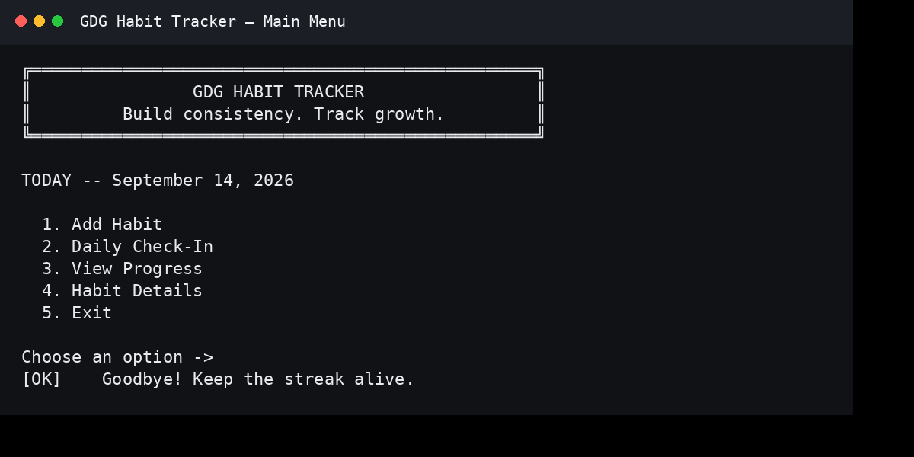
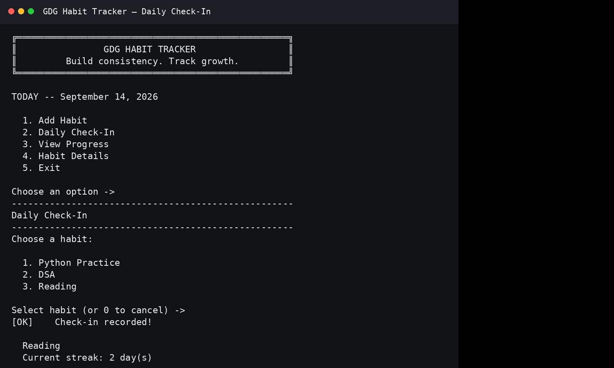
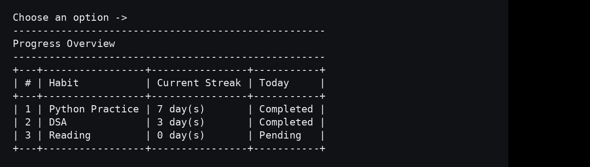

# GDG Habit Tracker 🚀

A polished command-line habit tracker built with Python that helps users build consistency through daily check-ins, active streaks, and reliable local persistence.

> **Built for the GDGoC MRUH Organizer Selection Process 2026–2027.**

## ✨ Why this project?

The project keeps the scope intentionally small, but treats the important parts seriously: a clear CLI, deterministic streak rules, validated local data, safe persistence, and tests for edge cases.

The key product rule is simple:

**Current streak = consecutive completed calendar days ending today.**

That means a habit with a strong run yesterday but no check-in today has a current streak of **0**. Its historical achievement is preserved separately through **Longest Streak**.

## 🎯 Features

- Add a habit with a name and description
- Validate and normalize user input
- Prevent duplicate habit names
- Daily check-in for the current day
- Prevent duplicate same-day check-ins
- Current streak and longest streak calculations
- Local JSON persistence across application restarts
- Atomic writes to reduce the chance of a truncated data file
- Recovery from missing, empty, corrupted, or malformed stored data
- Clean Windows-friendly command-line interface
- Automated tests covering core behavior and persistence edge cases

## 🖥️ Preview

### Main Menu



### Daily Check-In



### Progress Dashboard



The progress table uses ASCII characters for maximum compatibility with Windows PowerShell, Windows Terminal, and Command Prompt. The small Unicode banner is best-effort and falls back gracefully when a terminal cannot render it.

## 🛠️ Tech Stack

- **Python 3.11+**
- **JSON** for local persistence
- Python standard library only
- **unittest** for automated testing

No framework, database, network service, or third-party runtime dependency is required.

## 📁 Project Structure

```text
habit-tracker/
├── src/
│   ├── main.py            # CLI menus, prompts, and presentation
│   ├── habit_manager.py   # Domain model, validation, check-ins, streaks
│   ├── storage.py         # JSON persistence and recovery
│   └── utils.py           # Small shared helpers and terminal formatting
├── tests/
│   └── test_habit_manager.py
├── data/
│   └── habits.json        # Local data store
├── docs/
│   ├── main-menu.png
│   ├── check-in.png
│   └── progress.png
├── .gitignore
├── README.md
└── requirements.txt
```

## ⚙️ Installation

Requires **Python 3.11 or newer**. There are no packages to install.

### Windows PowerShell

```powershell
git clone https://github.com/tejasrirejeti-cloud/habit-tracker.git
cd habit-tracker
python --version
```

### macOS / Linux

```bash
git clone https://github.com/tejasrirejeti-cloud/habit-tracker.git
cd habit-tracker
python3 --version
```

## ▶️ Run the application

### Windows

```powershell
python src\main.py
```

### macOS / Linux

```bash
python3 src/main.py
```

On first launch, the `data` directory and `data/habits.json` are created automatically.

## 🧪 Run the tests

```powershell
python -m unittest discover -s tests -v
```

The test suite covers **27 cases**, including:

- habit creation and validation
- duplicate habit protection
- first and repeated check-ins
- current streak ending today
- current streak after a missed day
- longest streak calculation
- unordered and duplicate dates
- malformed and future dates
- missing, empty, and corrupted files
- invalid JSON schema and habit records
- duplicate habit IDs
- restart persistence

The repository should be considered submission-ready only when the full suite passes locally.

## 📊 Streak Logic

### Current streak

A current streak counts consecutive completed days **ending today**.

| Completion history | Current streak |
|---|---:|
| 3 days ago, 2 days ago, yesterday, today | 4 |
| 3 days ago, 2 days ago, yesterday, **not today** | 0 |
| 4 days ago, 3 days ago, yesterday, today | 2 |
| 3 days ago, 2 days ago, **gap**, today | 1 |

### Longest streak

Longest streak is the largest uninterrupted run anywhere in the habit's history. It remains useful even after the current streak ends.

Dates are parsed, de-duplicated, and future/malformed entries are excluded before streak calculations run.

## 💾 Data Persistence

Habits are stored locally in `data/habits.json`:

```json
{
  "habits": [
    {
      "id": "c88c0db2",
      "name": "Python Practice",
      "description": "Practice Python for 30 minutes",
      "created_at": "2026-09-14",
      "completed_dates": ["2026-09-14"]
    }
  ]
}
```

The application writes to a temporary file in the same directory, flushes and syncs it, then uses `os.replace()` to replace the previous file. This reduces the risk of leaving a partially written JSON file after an interrupted write; it cannot protect against every possible storage failure.

If the stored file is empty, corrupted, or has the wrong top-level structure, the original file is moved to a `.corrupted*.bak` backup where possible and the application starts with a fresh data set. Individual malformed habit records are skipped, while invalid check-in dates are cleaned up.

## 🎬 Demo

The required 1–2 minute walkthrough should show:

1. Launching the application
2. Adding a habit
3. Checking it in for today
4. Viewing the streak/progress
5. Exiting
6. Restarting the application
7. Showing that the habit and today's check-in persisted

**Video:** Add the final GitHub-hosted demo asset here before submission.

### Recommended GitHub video setup

Upload the 1–2 minute video through GitHub's web interface while editing the README (or attach it in a GitHub issue/comment to obtain a GitHub-hosted asset URL), then place the generated asset URL in this section. This avoids pretending that a raw repository `.mp4` file is automatically rendered as an inline player by every GitHub README renderer.

### Demo script — about 90 seconds

| Time | Action |
|---|---|
| 0:00–0:10 | Launch and show the main menu |
| 0:10–0:30 | Add `Python Practice` with a short description |
| 0:30–0:45 | Check the habit in for today |
| 0:45–1:05 | Open Progress and show the current streak |
| 1:05–1:15 | Exit |
| 1:15–1:25 | Restart the application |
| 1:25–1:30 | Show the persisted habit/check-in |

Keep the recording focused on the product. No long introduction or dead time.

## 📸 Screenshot Checklist

The three README screenshots should be captured from the working application:

| File | Capture |
|---|---|
| `docs/main-menu.png` | Fresh launch showing the banner, date, and menu |
| `docs/check-in.png` | Habit selection plus successful check-in confirmation |
| `docs/progress.png` | Progress table with several habits and different states |

For the strongest presentation, use realistic demo data and keep the terminal window large enough that no table or message wraps.

## 🔮 Future Improvements

Possible next iterations, without changing the intentionally lightweight architecture:

- weekly completion summary
- CSV export of habit history
- habit archiving
- optional reminders

These are future ideas only; they are not part of the current implementation.

## 👩‍💻 Submission Context

**Project:** GDG Habit Tracker  
**Selection:** GDGoC MRUH Organizer Selection Process 2026–2027  
**Author:** Tejasri Rejeti
